# HM15
### 1.создать файл config в котором перечислены значения вида key:value, создать скрипт который будет читать этот файл и выводить на экран в виде key=value
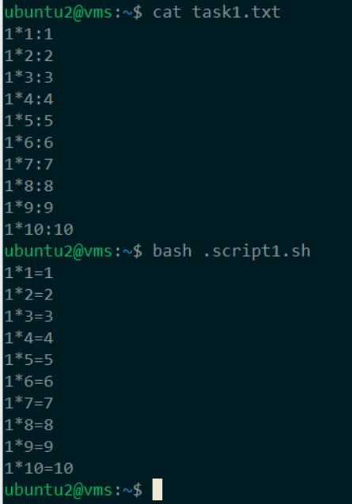
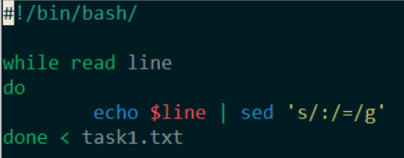
### 2.создать файл commands в котором перечислены значения вида name:command, создать скрипт который будет читать этот файл и запускать команды из него
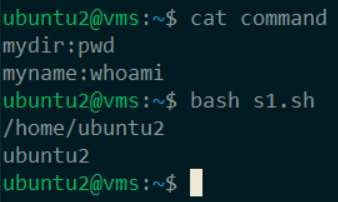
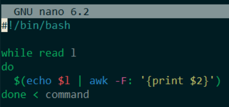
### 3.открыть консоль и узнать pid текущего процесса оболочки, открыть вторую консоль и отправить в первую консоль любое сообщение с помощью дескрипторов, тем же способом послать вывод команды lsblk
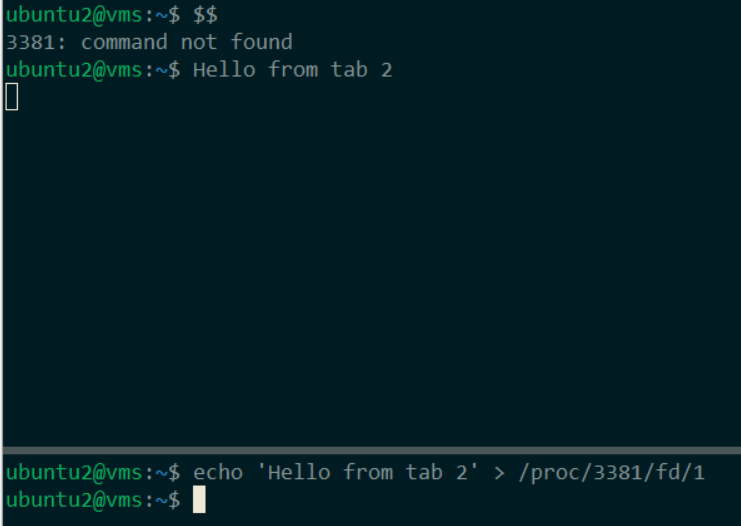
### 4.создать приглашение консоли в виде “полный путь - перенос строки - зеленый знак “$” если не root, а если root то тоже самое но красный цвет и знак “#”
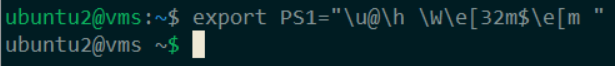
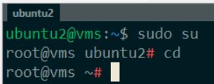
### 5.создать пользователя со стандартным расположением домашней директории и сменить ему домашнюю директорию на /tmp на постоянной основе
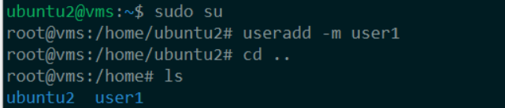
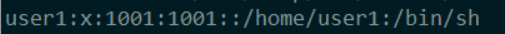
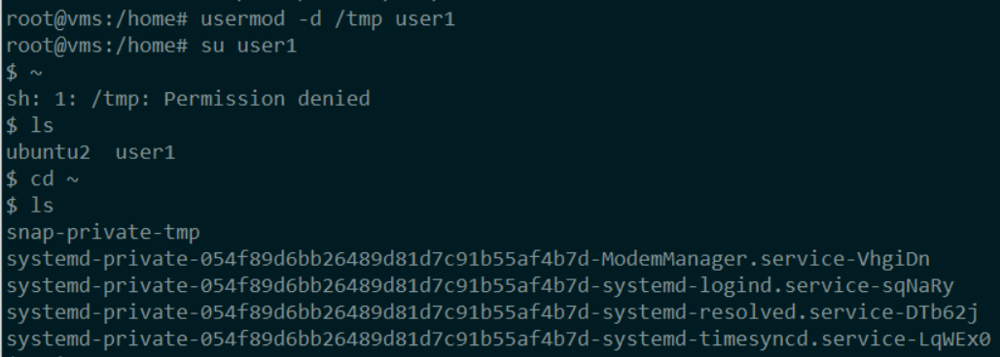
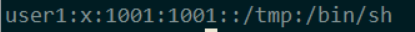
### 6.создать задание в CRON, запускающее скрипт, выполняющий lsblk с выводом в файл, с подавлением вывода stdout и stderr в самом кроне
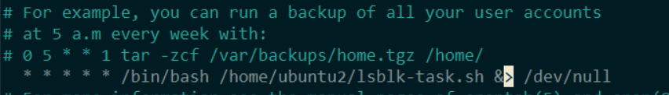
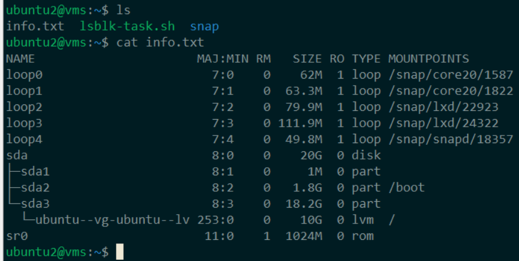
### 7. скопировать свои скрипты в /tmp и добавить в PATH путь до /tmp, попробовать запускать просто вводя имя скрипта находясь в домашней директории.
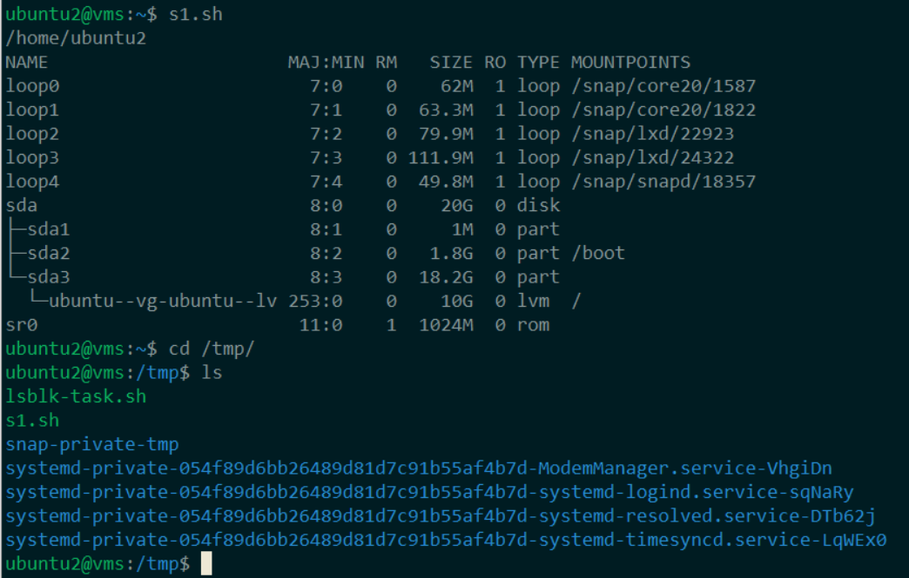
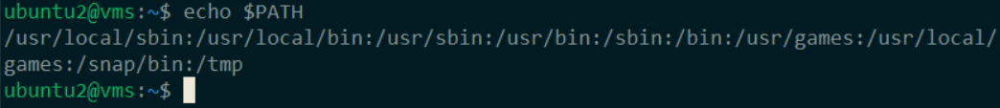