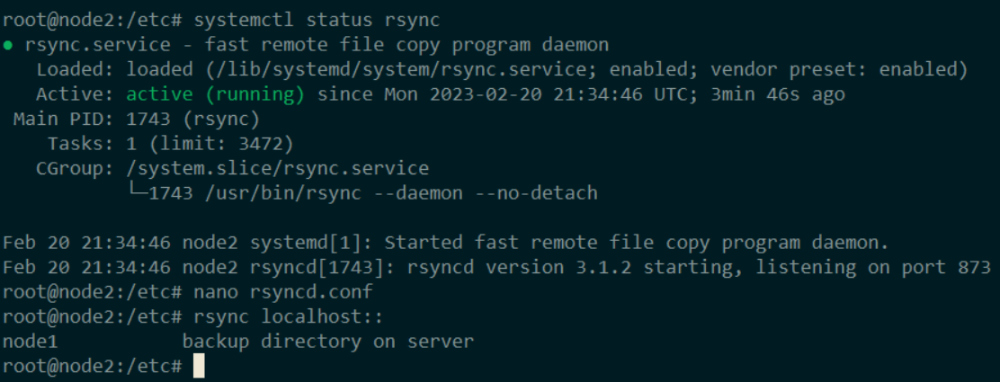
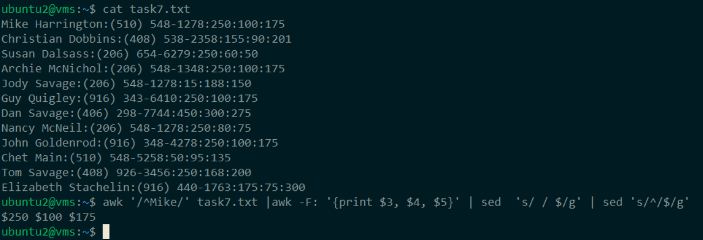

# HM14
### 1.Внутри ВМ создать 2 контейнера LXD с именами node1 и node2

### 2.Обеспечить доступ по ssh-ключам

### 3.Создать в домашних папках папку backup_logs и выполнить разовую синхронизацию папки /var/log/apt друг на друга в папку backup_logs исключив файл term.log
##### Сразу пытался сделать это на рядовых пользователях, тоесть создал в каждой ноде по юзеру, но ничего не вышло, тем самым догнав, что /var/logs/apt/ с правами суперпользователя, и сделав от рута все получилось. 

### 4.Установить rsyncd и создать группы настроек для папки/var/log/apt

### 5.Настроить синхронизацию папки /var/log/apt в кроне с использованием rsyncd исключив файл term.log
#### **У меня почему ошибка, не смог разобраться!**

### 6.Настроить синхронизацию папки /var/log/apt c помощью systemd timers с использованием rsyncd исключив файл term.log
#### **У меня почему ошибка, не смог разобраться!**

### 7. Работа с ***AWK и SED***
- ##### Выведите все номера телефонов.

- ##### Выведите номер телефона, принадлежащий сотрудника Dan.

- ##### Выведите имя, фамилию и номер телефона сотрудницы Susan.

- ##### Выведите все фамилии, начинающиеся с буквы D.

- ##### Выведите все имена, начинающиеся с буквы C или S.

- ##### Выведите все имена, состоящие только из четырех букв.

- ##### Выведите имена сотрудников, префикс номера телефона которых 916.

- ##### Выведите денежные вклады сотрудника Mike, предваряя каждую сумму знаком $
